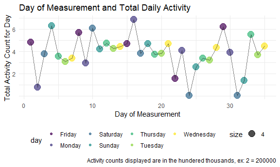
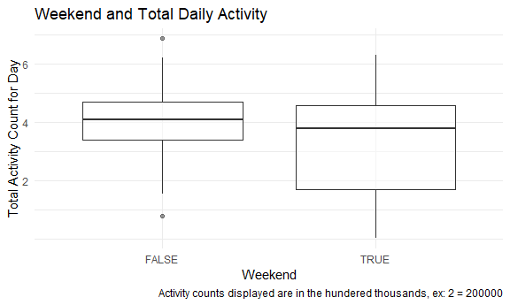

Homework 3
================
Laya Buchanan
2020-09-21

This is my submission for the third homework assignment for P8105.

# Problem 2: Accelerometer Data

## Read in the data

Read in the Accelerometer dataset.

``` r
accel_df = read_csv("./data/accel_data.csv")
```

## Clean the data

This code cleans up column names, creates a weekday vs weekend variable.

``` r
accel_df =
  janitor::clean_names(accel_df) %>%  
  mutate(
    weekend = case_when(
      day == "Monday" ~ "no",
      day == "Tuesday" ~ "no",
      day == "Wednesday" ~ "no",
      day == "Thursday" ~ "no",
      day == "Friday" ~ "no",
      day == "Saturday" ~ "yes",
      day == "Sunday" ~ "yes",
      TRUE ~ ""
    )) %>%
  mutate(weekend = recode(weekend, "yes" = TRUE, "no" = FALSE)) %>% 
  relocate(weekend, .after = day)
```

Next, I will check to see if the data is encoded with reasonable
variable classes.

``` r
accel_class_df = 
  accel_df %>% 
  summarise_all(typeof) %>% 
  select(week, day_id, day, weekend, activity_1)

kable(accel_class_df)
```

| week   | day\_id | day       | weekend | activity\_1 |
| :----- | :------ | :-------- | :------ | :---------- |
| double | double  | character | logical | double      |

We can see from the table above that week, day\_id, and the activity\_\*
variables are numeric, the weekend variable is logical, and the day
variable is a character variable. These are reasonable classes for the
variable types so no further action is needed

The resulting dataset contains 35 observations and 1444 variables. The
35 observations represent 35 days of accelerometer data collected on a
63 year-old male with BMI 25, who was admitted to the Advanced Cardiac
Care Center of Columbia University Medical Center and diagnosed with
congestive heart failure. The variables include the week number for each
of the seven weeks recorded, the number of the day recorded, the day of
the week for the observed day, a variable stating whether or not the
observed day was a weekend day, as well as 1440 activity\_\* variables,
each representing an activity count for each minute in the day.

## Aggregate data

This code creates an aggregate variable displaying total activity each
day.

``` r
accel_df = 
  accel_df %>% 
  rowwise() %>% 
  mutate(total_activity = sum(c_across(activity_1:activity_1440)))%>% 
  relocate(total_activity, .after = weekend)
```

In this next chunk of code, I am using a table to explore whether there
is any obvious relationship between total daily activity and the day of
monitoring and day of the week.

``` r
aggregate_df = 
  accel_df %>% 
  select(day_id, day, total_activity)

kable(aggregate_df)
```

| day\_id | day       | total\_activity |
| ------: | :-------- | --------------: |
|       1 | Friday    |       480542.62 |
|       2 | Monday    |        78828.07 |
|       3 | Saturday  |       376254.00 |
|       4 | Sunday    |       631105.00 |
|       5 | Thursday  |       355923.64 |
|       6 | Tuesday   |       307094.24 |
|       7 | Wednesday |       340115.01 |
|       8 | Friday    |       568839.00 |
|       9 | Monday    |       295431.00 |
|      10 | Saturday  |       607175.00 |
|      11 | Sunday    |       422018.00 |
|      12 | Thursday  |       474048.00 |
|      13 | Tuesday   |       423245.00 |
|      14 | Wednesday |       440962.00 |
|      15 | Friday    |       467420.00 |
|      16 | Monday    |       685910.00 |
|      17 | Saturday  |       382928.00 |
|      18 | Sunday    |       467052.00 |
|      19 | Thursday  |       371230.00 |
|      20 | Tuesday   |       381507.00 |
|      21 | Wednesday |       468869.00 |
|      22 | Friday    |       154049.00 |
|      23 | Monday    |       409450.00 |
|      24 | Saturday  |         1440.00 |
|      25 | Sunday    |       260617.00 |
|      26 | Thursday  |       340291.00 |
|      27 | Tuesday   |       319568.00 |
|      28 | Wednesday |       434460.00 |
|      29 | Friday    |       620860.00 |
|      30 | Monday    |       389080.00 |
|      31 | Saturday  |         1440.00 |
|      32 | Sunday    |       138421.00 |
|      33 | Thursday  |       549658.00 |
|      34 | Tuesday   |       367824.00 |
|      35 | Wednesday |       445366.00 |

There doesn’t seem to be any obvious patterns. How about a chart?

``` r
accel_df %>% 
  ggplot(aes(x = day_id, y = total_activity)) + 
  geom_point(aes(size = 4, color = day), alpha = .7) + geom_line(aes(), alpha = .5)+ 
  labs(
    title = "Day of Measurement and Total Daily Activity",
    x = "Day of Measurement",
    y = "Total Activity Count for Day",
    caption = "Activity counts displayed are in the hundered thousands, ex: 2 = 200000")+
  scale_y_continuous(
    breaks = c(200000, 400000, 600000), 
    labels = c(2, 4, 6))
```



We can kind of see some patterns here. This man’s activity level is very
variable on the weekends, with both some of his highest and loWest
activity days occuring on the weekends. His activity levels remain
closer to his mean in the middle of the week. Here’s a chart to more
fully explore this pattern:

``` r
accel_df %>% 
  ggplot(aes(x = weekend, y = total_activity)) + 
  geom_boxplot(aes(), alpha = .5) + 
  labs(
    title = "Weekend and Total Daily Activity",
    x = "Weekend",
    y = "Total Activity Count for Day",
    caption = "Activity counts displayed are in the hundered thousands, ex: 2 = 200000") +
  scale_y_continuous(
    breaks = c(200000, 400000, 600000), 
    labels = c(2, 4, 6))
```



This chart confirms our previous observations. While the mean total
daily activity is pretty similar whether or not it’s the weekend, it is
a little lower on the weekend with a much larger range of values.

What about in the course of the day?

``` r
accel_df %>% 
  pivot_longer(
    activity_1:activity_1440,
    names_to = "activity_number",
    names_prefix = "activity_",
    values_to = "activity_count"
  ) %>% 
  ggplot(aes(x = activity_number, y = activity_count, color = day_id)) +
  geom_line() + 
  labs(
    title = "24 hour Activity Time Courses",
    x = "Hour",
    y = "Activity Count") +
  scale_x_discrete(
    breaks = c(0, 180, 360, 540, 720, 900, 1080, 1260), 
    labels = c("12am", "3am", "6am", "9am", "12pm", "3pm", "6pm", "9pm" ))
```


We can see from this chart that this man is most active in the evening
hours, the early morning hours, and sometimes midday. We can also see
that the man seems to have become less active over the course of the
observation period.

# Problem 3: NY NOAA Data

## Read in the data

``` r
library(p8105.datasets)
data("ny_noaa")
```

This dataset is a able consisting of 259176 observations and 7
variables. These variables include id (the weather station ID), date,
prcp (precipitation), snow and snwd (snowfall and snowdepth in mm), tmax
and tmin (the maximum and minimum temperature recorded in tenths of
degrees C). A considerable number of measurements for the precipitation,
snowfall, and temperature measurements are missing, which could present
issues depending on the data analysis you intend to conduct. The large
number of observations can also be difficult for some devices to handle,
and there is no benefit as many of the observations contain no useful
measurements.

## Data Cleaning

This code creates separate variables for year, month and day, lists the
name of the month rather than the number, and removes rows with no
measurements for precipitation, snow, or temperature.

Now, I will check to see if the variables are encoded with reasonable
class types:

``` r
noaa_class_df = 
  ny_noaa %>% 
  summarise_all(typeof)

kable(noaa_class_df)
```

| id        | date   | prcp    | snow    | snwd    | tmax      | tmin      |
| :-------- | :----- | :------ | :------ | :------ | :-------- | :-------- |
| character | double | integer | integer | integer | character | character |

tmin and tmax currently exists as character vectors. This could present
a problem for data analysis. I will address this issue in the next
cleaning step.

Here, I am separating the data variable into month, day, and year
variables, converting the minimum and maximum temperatures into a more
reasonable class type, and changing the snow and temperature units into
more intuitive units.

``` r
ny_noaa_df = 
ny_noaa %>% 
  separate(date, into = c("year", "month", "day")) %>% 
  mutate(month = recode(month, `01` = "january", `02` = "february",  `03` = "march", `04` = "april", `05` = "may", `06` = "june", `07` = "july", `08` = "august", `09` = "september", `10` = "october", `11` = "november", `12` = "december")) %>% 
  mutate(
    tmin = as.numeric(tmin),
    tmax = as.numeric(tmax),
    tmin = tmin/10,
    tmax = tmax/10,
    snow = snow/10,
    snow = snow/10
  )
```

``` r
ny_noaa %>% 
  group_by(snow) %>%
  summarize(
    n_obs = n())
```

    ## `summarise()` ungrouping output (override with `.groups` argument)

    ## # A tibble: 282 x 2
    ##     snow   n_obs
    ##    <int>   <int>
    ##  1   -13       1
    ##  2     0 2008508
    ##  3     3    8790
    ##  4     5    9748
    ##  5     8    9962
    ##  6    10    5106
    ##  7    13   23095
    ##  8    15    3672
    ##  9    18    3226
    ## 10    20    4797
    ## # ... with 272 more rows

The most commonly observed snowfall value is 0mm because it does not
snow on most days in New York.

``` r
jan_p = 
  ny_noaa_df %>% 
  filter(month == "january") %>%
  group_by(year) %>% 
  summarize(
      mean_tmax = mean(tmax, na.rm = TRUE)
  ) %>% 
  ggplot(aes(x = year, y = mean_tmax)) + 
    geom_point() + geom_line() +
  scale_x_discrete(
    breaks = c(1985, 1990, 1995, 2000, 2005)) +
  labs(
    title = "Average Maximum Temperature in January",
    x = "Year",
    y = "Average Maximum Temperature")
```

    ## `summarise()` ungrouping output (override with `.groups` argument)

``` r
jul_p = 
ny_noaa_df %>% 
  filter(month == "july") %>%
  group_by(year) %>% 
  summarize(
      mean_tmax = mean(tmax, na.rm = TRUE)
  ) %>% 
  ggplot(aes(x = year, y = mean_tmax)) + 
    geom_point() + geom_line() +
  scale_x_discrete(
    breaks = c(1985, 1990, 1995, 2000, 2005)) +
  labs(
    title = "Average Maximum Temperature in July",
    x = "",
    y = " (Degrees Celcius)")
```

    ## `summarise()` ungrouping output (override with `.groups` argument)

``` r
jul_p/jan_p
```

    ## geom_path: Each group consists of only one observation. Do you need to adjust
    ## the group aesthetic?

    ## geom_path: Each group consists of only one observation. Do you need to adjust
    ## the group aesthetic?


``` r
tmax_p = 
  ggplot(ny_noaa_df, aes(x = tmax, fill = "blue")) + 
  geom_histogram(alpha = .4, adjust = .5, color = "blue")
```

    ## Warning: Ignoring unknown parameters: adjust

``` r
labs(
    title = "Max daily Temperature Frequencies",
    x = "Max Temp",
    y = "Frequency") +
  scale_y_continuous(
    breaks = c(200000, 400000, 600000), 
    labels = c(2, 4, 6))
```

    ## NULL

``` r
tmin_p = 
  ggplot(ny_noaa_df, aes(x = tmin, fill = "blue")) + 
  geom_histogram(alpha = .4, adjust = .5, color = "blue")
```

    ## Warning: Ignoring unknown parameters: adjust

``` r
labs(
    caption = "Min daily Temperature Frequencies",
    x = "Max Temp",
    y = "Frequency")
```

    ## $x
    ## [1] "Max Temp"
    ## 
    ## $y
    ## [1] "Frequency"
    ## 
    ## $caption
    ## [1] "Min daily Temperature Frequencies"
    ## 
    ## attr(,"class")
    ## [1] "labels"

``` r
tmin_p/tmax_p
```

    ## `stat_bin()` using `bins = 30`. Pick better value with `binwidth`.

    ## Warning: Removed 1134420 rows containing non-finite values (stat_bin).

    ## `stat_bin()` using `bins = 30`. Pick better value with `binwidth`.

    ## Warning: Removed 1134358 rows containing non-finite values (stat_bin).


